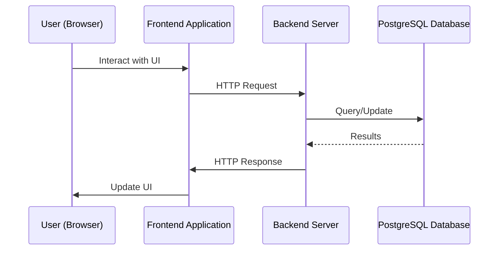

To run

```
docker-compose build --no-cache
docker-compose up
```

To create certificate

```
openssl req -x509 -nodes -days 365 -newkey rsa:2048 -keyout nginx/certs/nginx.key -out nginx/certs/nginx.crt
openssl dhparam -out nginx/certs/dhparam.pem 4096
```


